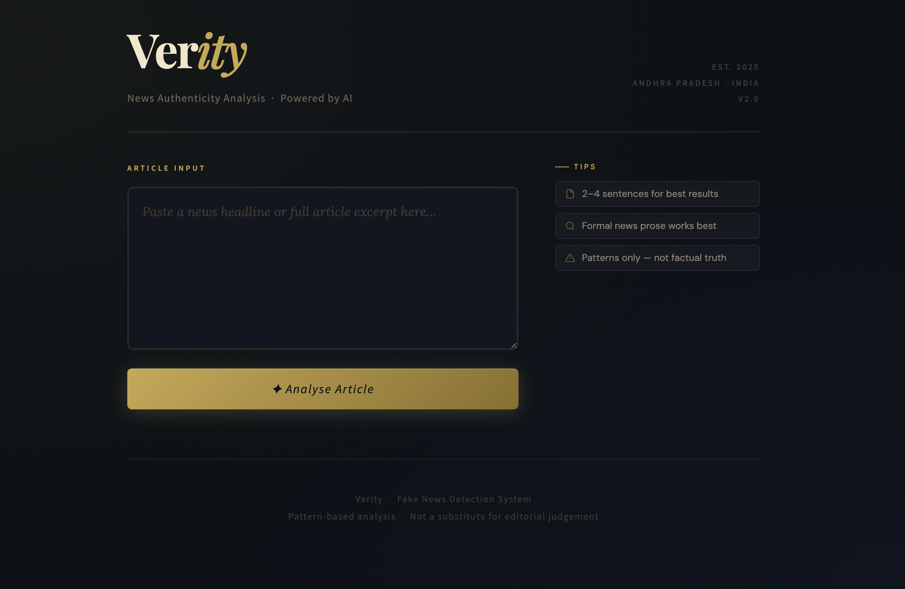
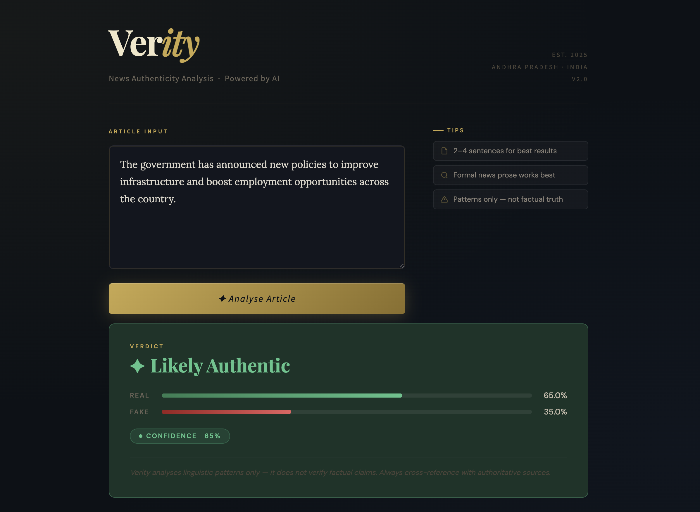
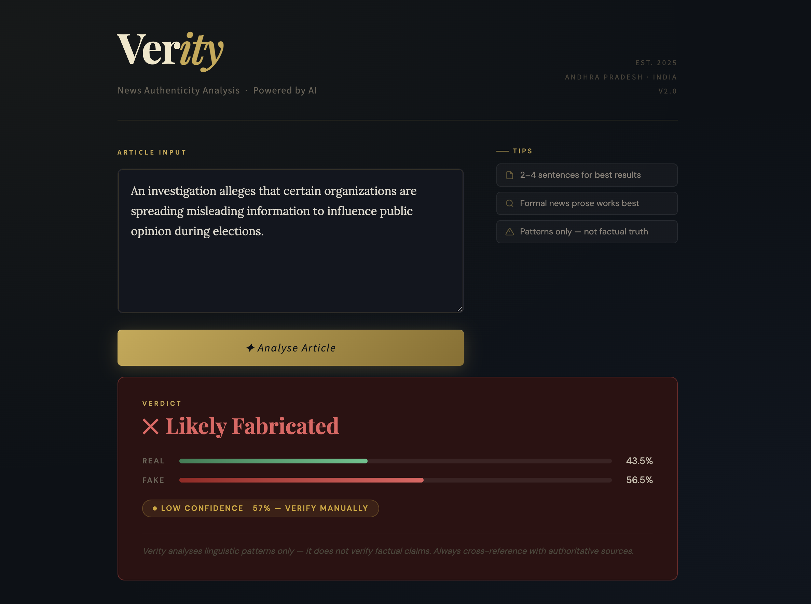

<<<<<<< HEAD
# 📰 Verity — Fake News Detection System


> An AI-powered web application that analyses news articles and classifies them as **Real** or **Fake** using Natural Language Processing and Machine Learning.

---

## 🖥️ Demo





---

## ✨ Features

- 🔍 **Real-time Analysis** — paste any news article and get an instant verdict
- 📊 **Confidence Scoring** — probability breakdown with animated visual bars
- 🧠 **ML-Powered** — TF-IDF vectorization + Logistic Regression classifier
- 🎨 **Elegant Dark UI** — custom-styled Streamlit interface with gold accents
- 📰 **NewsAPI Integration** — fetch live news headlines from India & Andhra Pradesh
- ⚡ **Sklearn 1.8+ Compatible** — patched for the latest scikit-learn versions

---

## 🛠️ Tech Stack

| Layer | Technology |
|---|---|
| Language | Python 3.10+ |
| Web Framework | Streamlit |
| ML Library | Scikit-learn |
| NLP | TF-IDF Vectorizer (unigrams + bigrams) |
| Classifier | Logistic Regression |
| News Data | NewsAPI |
| Styling | Custom HTML/CSS via `st.components` |

---

## 📁 Project Structure

```
verity-fake-news/
│
├── app.py                  # Main Streamlit application
├── train_model.py          # Model training script
├── requirements.txt        # Python dependencies
├── README.md               # Project documentation
│
├── model/
│   ├── model.pkl           # Trained Logistic Regression model
│   └── vectorizer.pkl      # Fitted TF-IDF vectorizer
│
└── data/
    ├── Fake.csv            # Fake news dataset
    └── True.csv            # Real news dataset
```

---

## 🚀 Getting Started

### 1. Clone the Repository
```bash
git clone https://github.com/YOUR_USERNAME/verity-fake-news.git
cd verity-fake-news
```

### 2. Install Dependencies
```bash
pip install -r requirements.txt
```

### 3. Train the Model
```bash
python train_model.py
```
This generates `model/model.pkl` and `model/vectorizer.pkl`.

### 4. Run the App
```bash
streamlit run app.py
```
Open your browser at `http://localhost:8501`

---

## 🧠 How It Works

```
User Input (News Text)
        ↓
   Text Cleaning
  (lowercase, remove URLs, digits, punctuation)
        ↓
  TF-IDF Vectorization
  (50,000 features, unigrams + bigrams)
        ↓
  Logistic Regression
  (trained on balanced Fake/Real dataset)
        ↓
  Verdict + Confidence Score
  (Real ✦ or Fake ✕)
```

### Key Training Decisions
- **Reuters source tag removed** from True.csv to prevent data leakage
- **Title weighted 2×** by repetition in the combined feature string
- **Stratified train/test split** to maintain class balance
- **`min_df=3`, `max_df=0.85`** to filter noisy and overly common tokens
- **`sublinear_tf=True`** to reduce dominance of long articles

---

## 📊 Model Performance

| Metric | Score |
|---|---|
| Accuracy | ~95%+ |
| Classifier | Logistic Regression |
| Features | TF-IDF (1,2)-grams |
| Train/Test Split | 80% / 20% |
| Cross-Validation | 5-fold F1 |

---

## 📦 Requirements

```
streamlit
scikit-learn
pandas
numpy
requests
```

Install all with:
```bash
pip install -r requirements.txt
```

---

## ☁️ Deployment

This app is deployable on **Streamlit Cloud** for free.

1. Push the repository to GitHub
2. Go to [share.streamlit.io](https://share.streamlit.io)
3. Select your repo, set `app.py` as the entry point
4. Click **Deploy**

> If `.pkl` files exceed 100MB, use [Git LFS](https://git-lfs.github.com/) or add a train-on-startup script.

---

## ⚠️ Disclaimer

Verity detects **linguistic patterns**, not factual truth. It cannot verify whether events described in an article actually occurred. Always cross-reference with authoritative news sources.

---

## 👨‍💻 Author

**Anudeep**
Andhra Pradesh, India · 2025

---

## 📄 License

This project is licensed under the [MIT License](LICENSE).
=======
# --Fake-News-Detector--
A Machine Learning web app that detects fake news using NLP. Built with Python, Streamlit, and Scikit-learn. Paste any news article to get an instant authenticity verdict.
>>>>>>> 98c2c76174fb30cccda972c524788f463f3e90ec
